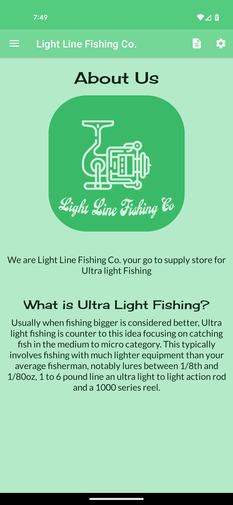
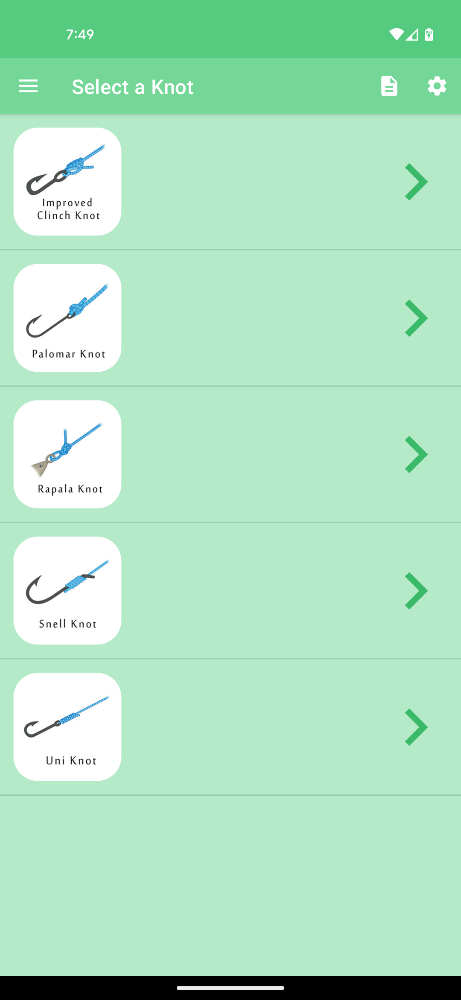

 # Light Line Fishing Co.
 ---
## Description:
- This is an application for the fictional company Light Line Fishing Co. a specialty ultralight fishing supply company.
- Platform: Android
- Language: Java
- Minimum SDK: 23

## Layout
This is a Nav Drawer Application
### Home Screen

### Menu

### Knot Menu

This is a ListView, each item is clickable and navigates to the knot tool 
### Knot Tool

This is a ViewPager2 users can swipe back and forth through the steps to learn how to tie the knot they selected 

### Credits 

#### Icons:
- [reel](https://www.flaticon.com/free-icon/reel_6678216?term=fishing%20reel&page=1&position=34&page=1&position=34&related_id=6678216&origin=tag)
- [rod](https://www.flaticon.com/free-icon/fishing-rod_8842243?related_id=8842243&origin=search)
- [fish](https://www.flaticon.com/free-icon/fish_3050551?term=fish&related_id=3050551)
- [knot](https://www.flaticon.com/free-icon/knot_4299778?term=knot&page=1&position=2&page=1&position=2&related_id=4299778&origin=search)
- [fish on rod](https://www.flaticon.com/free-icon/fishing_1830741?term=fishing&page=1&position=1&page=1&position=1&related_id=1830741&origin=search)
- [lure](https://www.flaticon.com/free-icon/fishing-baits_4090542?related_id=4090542)
#### Images:
- [menu header](https://unsplash.com/photos/3nalUfmyG-s)
- [knot images](https://www.101knots.com/category/fishing-knots)
